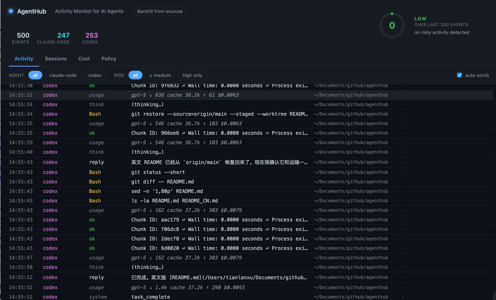
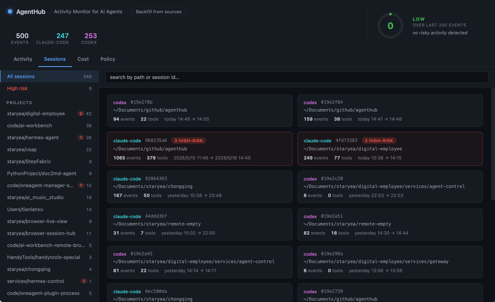
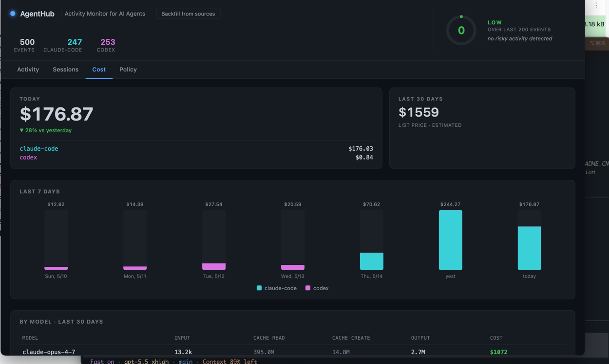
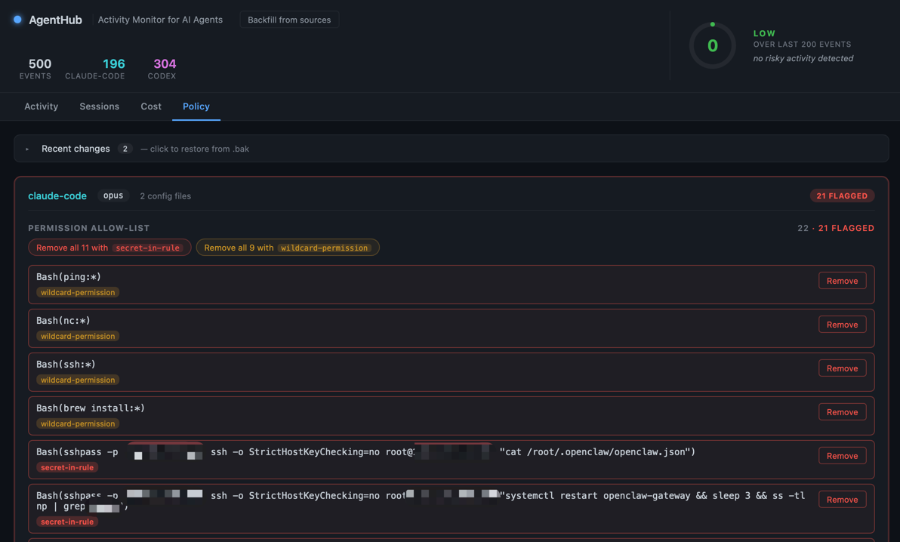

# AgentHub

> See, control and secure all your AI coding agents in one place.

A local-first desktop dashboard that watches every action your AI coding agents
take — Claude Code, Codex, and more — scores their risk, tracks their cost,
and lets you clean up the dangerous configuration they accumulate.

## Screenshots

### Activity



### Sessions



### Cost



### Policy



---

## What it does

- **Live Activity Monitor** — every `Read` / `Bash` / `Edit` / `WebFetch` your
  agents perform, in real time. ~2 second latency, ~0 % CPU.
- **Risk Score (0–100)** — auto-flags shell-dangerous commands, secret paths
  (`.env`, `.ssh`, `id_rsa`), network calls, and unrestricted permissions.
  Glows red at the top of the window when activity gets sketchy.
- **Sessions Browser** — every conversation indexed and grouped by project /
  cwd. Lazy-loaded, searchable by path or session id.
- **Cost Dashboard** — true daily spend across Claude and Codex models,
  accounting for prompt caching (input vs. cache-read vs. cache-create vs.
  output). Stops you from being surprised by the bill.
- **Policy & Hardening** — surfaces the dangerous things that pile up in
  `~/.claude/settings.local.json` and `~/.codex/config.toml`: SSH passwords
  hard-coded in `permissions.allow[]`, plaintext API tokens in proxy
  headers, wide-open wildcards like `Bash(curl:*)`. One-click (or
  one-batch) removal with atomic writes and per-write `.bak` files.
- **Backfill from sources** — full historical scan of JSONL session files,
  idempotent via content hashing. Imports months of past activity in
  seconds.

---

## What it isn't

- Not a sandbox / not OS-level interception. AgentHub watches and edits
  config; it does not hook syscalls.
- Not a cloud product. Everything lives in `~/Library/Application Support/com.agenthub.dev/events.db` and never leaves your machine.
- Not (yet) Windows / Linux. macOS only for now (the agents we target ship
  Mac binaries first).

---

## Quick start

Requires: macOS, Node ≥ 18, Rust (`rustup` will install it on first run).

```bash
cd app
npm install
npm run tauri dev
```

The window will open and immediately start tailing your `~/.claude/projects/`
and `~/.codex/sessions/` directories. Use your agents normally; events
appear within ~1 second.

On first run, click **"Backfill from sources"** in the top-left header to
import all your historical sessions. This is idempotent and safe.

---

## Architecture

```
┌──────────────────────────────────────┐
│  Tauri 2 Desktop App                 │
│  ┌────────────────────────────────┐  │
│  │  React + TypeScript            │  │
│  │  Activity · Sessions · Cost ·  │  │
│  │  Policy                        │  │
│  └─────────────┬──────────────────┘  │
│                │ Tauri IPC            │
│  ┌─────────────▼──────────────────┐  │
│  │  Rust backend                  │  │
│  │  - Source adapters             │  │
│  │    Claude (JSONL)  Codex (JSONL)│ │
│  │  - Polling tail, 500ms         │  │
│  │  - Risk + Usage analyzers      │  │
│  │  - SQLite (events + sessions)  │  │
│  │  - Policy reader / safe writer │  │
│  └────────────────────────────────┘  │
└──────────────────────────────────────┘
        │                  │
        ▼                  ▼
 ~/.claude/...     ~/.codex/...
```

Detailed module layout and design decisions in [`plan/ARCHITECTURE.md`](plan/ARCHITECTURE.md).

---

## Status

Core MVP (per the [PRD](AgentHub_PRD.md)):

- [x] Activity Monitor
- [x] Timeline (Session detail view)
- [x] Risk Score
- [x] One-click & batch hardening (Policy view)
- [x] Multi-Agent Dashboard — Claude Code + Codex (Cursor adapter pending)

Beyond the original MVP:

- [x] SQLite persistence with materialized sessions table
- [x] Cost / token tracking with cache-aware pricing
- [x] Full backfill from JSONL sources, idempotent
- [x] Sessions categorized by project, lazy-loaded, searchable
- [x] Hooks parsing + per-hook risk flagging
- [x] Atomic config edits with timestamped `.bak` files
- [x] Undo / restore from backup

What's next: [`plan/ROADMAP.md`](plan/ROADMAP.md). Tactical task list: [`plan/BACKLOG.md`](plan/BACKLOG.md).

---

## Privacy

- All data stays local, in SQLite, in your user's `Application Support` directory.
- No telemetry. No analytics. No automatic upload.
- Secret values in your config (Authorization headers, passwords) are
  **never** shipped anywhere — they're flagged in the UI and you decide
  whether to delete them.
- The app reads from your home directory only; it never writes anywhere
  outside its own data dir and the config files you explicitly edit
  through the Policy view.

---

## Contributing

The project isn't a git repo yet:

```bash
cd /Users/tianlanxu/Documents/github/agenthub
git init
git add .
git commit -m "initial commit"
```

Useful files for orientation:

- [`AgentHub_PRD.md`](AgentHub_PRD.md) — the original product framing
- [`plan/ARCHITECTURE.md`](plan/ARCHITECTURE.md) — how the code is laid out
- [`plan/ROADMAP.md`](plan/ROADMAP.md) — what's next
- [`plan/BACKLOG.md`](plan/BACKLOG.md) — granular tasks
- [`agenthub-tail/`](agenthub-tail/) — original CLI prototype, kept as a
  minimum reproducible demo of the JSONL parser

---

## License

MIT — see [`LICENSE`](LICENSE).
